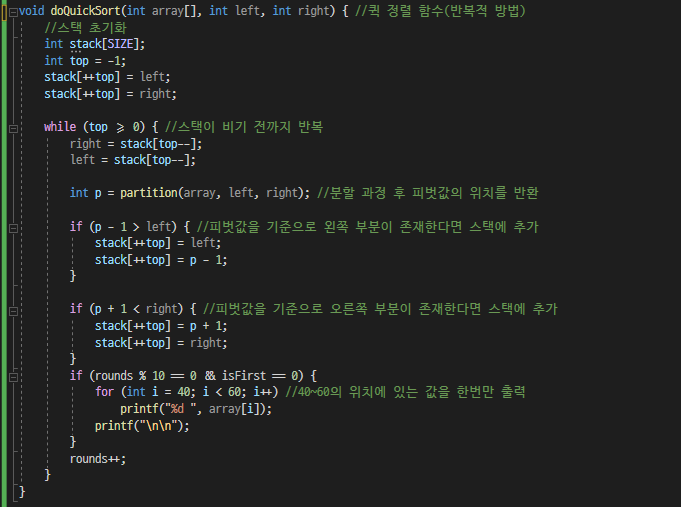

# Quick Sorting {Result Image}
*재귀적 방법으로 구현*
.PNG)

*반복적 방법으로 구현*
.PNG)

# 보너스 문제 풀이

# 이전 정렬방법(선택, 삽입, 버블, 쉘, 합병)과 성능 비교 설명
| 정렬 | 최선의 경우 | 평균의 경우 | 최악의 경우 | 제자리 정렬 | 안정성 |
|------|-------------|--------------|-------------|-------------|--------|
| 선택 |    O(n²)    |     O(n²)    |     O(n²)    |    가능     | 불안정 |
| 삽입 |     O(n)    |     O(n²)    |     O(n²)    |    가능     |  안정  |
| 버블 |    O(n²)    |     O(n²)    |     O(n²)    |    가능     |  안정  |
|  쉘  |     O(n)    |    O(n¹·⁵)   |    O(n¹·⁵)   |    가능     | 불안정 |
| 합병 |  O(nlogn)   |   O(nlogn)   |   O(nlogn)   |    불가능    |  안정  |
|  퀵  |    O(n²)    |   O(nlogn)   |   O(nlogn)   |    가능     | 불안정 |
