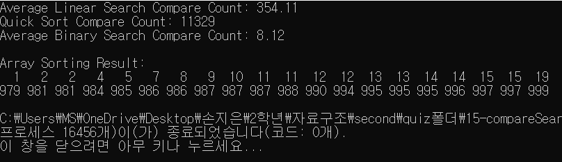
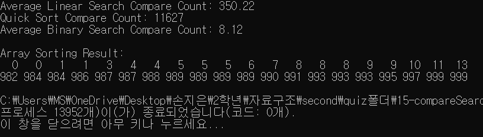
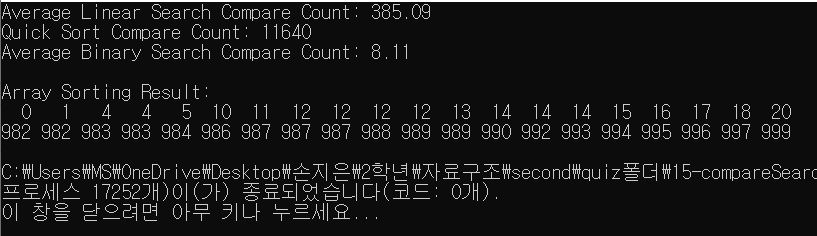

# Linear Search & Binary Search {Result Image}

# A, B, C에 대해서 퀵 정렬후의 이진탐색에서 순차탐색보다 적게 비교하는 이유
**평균 비교횟수 A: 350번대, 비교횟수 B: 11000번대, 비교횟수 C: 8번대**

순차탐색은 탐색 방법 중에서 가장 간단하고 직접적인 탐색 방법이긴하나, 정렬되지 않은 배열을 처음부터 끝까지 하나씩 검사해야하기 때문에 비교횟수가 B와 C에 비해 상대적으로 많은 편입니다. 그리고 이진탐색은 정렬된 배열의 중간값을 기준으로 타겟값과 중간값을 계속 비교하면서 검사해 탐색 범위를 반으로 줄여가며 탐색하는 방법으로, 1000개의 데이터를 탐색하는 과정에서 평균적으로 8번대가 나왔다는 것은 A보다 빠르게 탐색했다는 것을 보여줍니다. 
즉, 분할 정복 방식을 사용하는 퀵 정렬을 한 뒤 이진탐색을 하면 순차탐색의 비교횟수보다 퀵 정렬후의 이진탐색의 비교횟수가 훨 적다는 것을 알 수 있습니다. (이진탐색이 훨씬 효율적임.)
