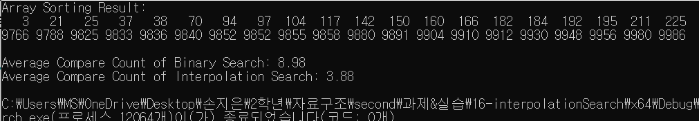
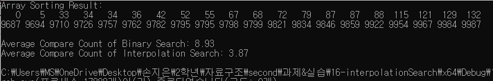
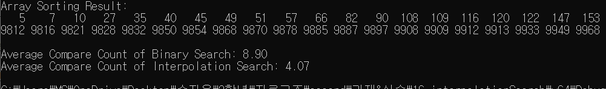

# Interpolation Search {Result Image}

# Interpolation Search가 Binary Search보다 적게 비교하는 이유
보간 탐색이 이진 탐색보다 비교횟수가 더 적은 이유는, 이진 탐색은 분포되어 있는 데이터와 상관없이 탐색하는 과정에서 항상 절반으로 줄여나가는 분할 방식을 사용하는데, 보간 탐색은 보간 공식을 통해 타겟값의 위치를 예측하여 찾으려는 값의 위치를 선택하는 방식을 사용하기 때문입니다. 코드 결과를 보시면 이진 탐색의 평균 비교횟수와 보간 탐색의 평균 비교횟수가 거의 1/2배 정도 차이나는 것을 알 수 있습니다. 이는 데이터가 균등하게 분포되어있기 때문에 타겟값의 위치를 정확히 예측할 수 있어 이진 탐색보다 보간 탐색의 비교횟수가 더 적은 것입니다.
그러나 보간 탐색은 데이터가 균등하게 분포돼있지 않는 경우에는 타겟값의 위치를 정확하게 예측할 수 없기 때문에 이진 탐색보다 느리고, 비효율적으로 성능이 떨어질 수 있습니다.
