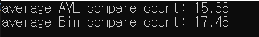

# AVL Tree {Result Image}

# 이진 탐색 트리와 AVL에 대한 탐색의 비교횟수를 비교분석
**AVL 트리 비교횟수: 평균 15번대, 이진 탐색 트리 비교횟수: 평균 17-18번대**
AVL 트리는 균형 이진 탐색 트리로, 이진 탐색 트리와는 달리 트리가 비균형 상태일 때 회전 연산을 사용해 균형을 유지하는 성질이 있습니다. 그렇기 때문에 AVL 트리는 항상 트리의 높이가 O(log n)이 되도록 해 탐색, 삽입, 삭제를 할 때에도 항상 O(log n)의 시간 복잡도에서 수행할 수 있게 하는 장점이 있습니다.
반면에 이진 탐색 트리는 트리가 비균형 상태일 때 AVL 트리처럼 균형을 잡는 일이 없어 O(n)와 같은 최악의 시간 복잡도를 가집니다. 
결론적으로, AVL 트리는 균형을 유지하기 때문에 이진 탐색 트리보다 비교횟수가 적은 것을 알 수 있습니다.
